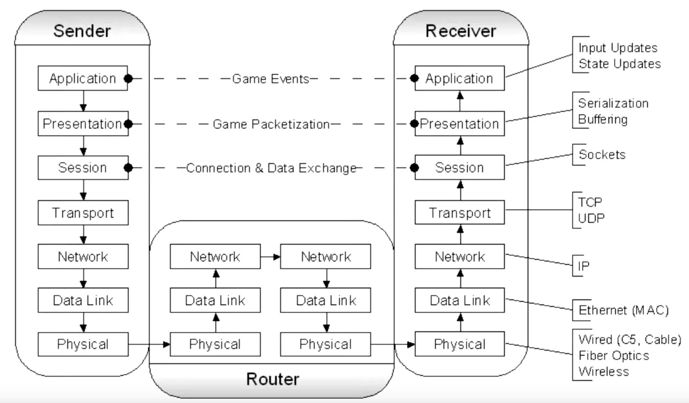
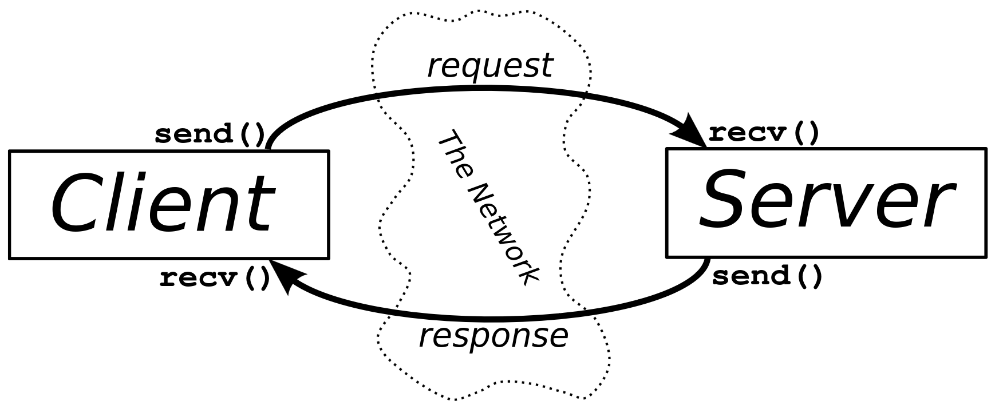

# Networking from Beej's Guide to Network Programming:
This is a summary of [Beej's Guide to Network Programming](https://beej.us/guide/bgnet/). If something is not understandable, have a look the the original Guide, it explains it in greater detail --> [Beej's Guide to Network Programming](https://beej.us/guide/bgnet/)
## Chapter 2: What is a Socket?
### 2.1 What are sockets?
A way to speak to other programs using standard Unix file descriptors. Everything on Unix is a file and I/O is always done by reading/writing from/to a file descriptor.

### 2.2 Where do I get the this file descriptor?
A call to `socket()`. Then you can communicate via `send()` and `recv()` (use man).
`read()` and `write()` would also work, but prior functions offer much more control over the data transmission.
There are lots of different types of sockets, but for the HTTP server we just need Internet sockets for now.

### 2.3 Are there several types of Internet sockets?
Yes, there are many however we for now focus on two types of sockets. One is the "Stream Socket" also refered to as "SOCK_STREAM" and the other is the "Datagram Socket" also refered to as "SOCK_DGRAM" and sometimes called "connectionless socket".

### 2.4 What is a "SOCK_STREAM"?
Stream sockets are reliable two-way connected communication stream. They work like pipes with the FIFO method.

### 2.5 What uses Stream Sockets?
`telnet` (`man telnet`) and `ssh` applications for example use stream sockets. The web browser with HTTP also uses Stream Sockets to get pages.
To get an first idea on how it works, you can try to telnet to a website over port 80. Type the following example into the command line: `telnet google.com 80`. It will open telnet with a prompt `telnet>` then type	"GET / HTTP/1.0" and hit RETURN twice. Then you will recieve the response from the server.
```
user@hostname: ~/cwd$ telnet google.com 80'
telnet> GET / HTTP/1.0

(HTTP Response)
```
### 2.6 How do stream sockets achieve this high level of data transmission quality?
They use a protocol called TCP (Transmission Control Protocoll) (`man TCP`) which makes sure that the data arrives sequentually and error-free. It is usually seen paired with IP (Internet Protocoll) as TCP/IP, where IP deals primarily with the routing and TCP ensures the data integrity.

### 2.7 What is a "SOCK_DGRAM"? Why are they also called connectionless sockets?
Connectionless sockets are called so because they do not establish a persistent connection between the sender and receiver. Instead, they send discrete packets of data called datagrams. Each datagram is independent and self-contained, containing all the necessary information for the receiver to process it. This means the packet might arrive or not arrive. If it arrives, the data within the datagram will be error-free.
Those sockets use IP, but instead of TCP they use UDP (User Datagram Protocol).


### 2.8 What Datagram Sockets used for?
Datagram sockets are often used in scenarios where a reliable, ordered delivery of data is not required, and where the focus is on lightweight, low-latency communication. Examples of applications that use datagram sockets include DNS (Domain Name System) and DHCP (Dynamic Host Configuration Protocol). Another examples include online gaming, audio and video streaming and video conferencing. For example YouTube always preloads videos so the video can keep running even if the internet connection drops for a moment. If packets are dropped in online games, it usually leads to well known "lags".
Some applications like `tftp` (trivial file transfer protocol, a little brother to FTP) or `dhcpcd` transfer binary applications from one host to another, so nothing can be lost. Well in this case for example `tftp` waits for the recepient to sent a packet back that aknowledges a successfull reception. If it is not recieved in a certain amount of time, the package will be retransmitted. This procedure is extremly important to ensure reliable `SOCK_DGRAM` applications.

### 2.9 Network Theory and encapsulation
`SOCK_DGRAM` packets are built through encapsulation, which means each protocoll adds another another layer of encapsulation:


A packet is born, the packet is wrapped ("encapsulated") in a header (and rarely a footer) by the first
protocol (say, the TFTP protocol), then the whole thing (TFTP header included) is encapsulated again by
the next protocol (say, UDP), then again by the next (IP), then again by the final protocol on the hardware
(physical) layer (say, Ethernet).
When another computer receives the packet, the hardware strips the Ethernet header, the kernel strips the
IP and UDP headers, the TFTP program strips the TFTP header, and it finally has the data.
The *Layered Network Model* aka "ISO/OSI":



The next model has less Layers, however the following model is more consistent with Unix and the idea of encapsulation:
- Application Layer (telnet, ftp, etc.)
- Host-to-Host Transport Layer (TCP, UDP)
- Internet Layer (IP and routing)
- Network Access Layer (Ethernet, wi-fi, or whatever)
Stream Sockets just need to `send()` the data out, while datagram sockets need to encapsulate the data with another method and then `sendto()` another host.
The kernel builds the Transport and Internet Layer while the hardware does the Network Access Layer.


## Chapter 3: IP Addresses, Structs and Data Munging
### 3.1 IP Addresses, versions 4 and 6
We ran out of IPv4 Adresses because they were generously allocated to companies and there are just so many computers, espacially small computers such as phones, IoT and so on around the world.So IPv6 was born.
Here is a small table comparing IPv4 and IPv6:
| IPv4 | IPv6 |
|------|------|
| Uses 32-bit addresses | Uses 128-bit addresses |
| Provides approximately 4.3 billion unique addresses | Provides approximately 340 undecillion unique addresses |
| Address format: xxx.xxx.xxx.xxx | Address format: xxxx:xxxx:xxxx:xxxx:xxxx:xxxx:xxxx:xxxx |
| Uses decimal notation | Uses hexadecimal notation |
| Less efficient in terms of address space | More efficient in terms of address space |
| Limited support for built-in security features | Built-in support for IPsec and other security features |
| Network address translation (NAT) is commonly used to conserve IPv4 addresses | No need for NAT due to the abundance of IPv6 addresses |
| Widely used and supported | Adoption is still ongoing |
| Loopback adress: 127.0.0.1 | Loopback adress: ::1 |
| 192.0.2.33 | ::ffff:192.0.2.33 |

### 3.2 Subnets
Subnetting should be clear through the previous 42 project on subnetting. As in IPv4 IPv6 also allowes the use of subnet masks aka a slash followed the number of network bits:
`192.0.2.12/30` and int IPv6 `2001:db8::/32` or `2001:db8:5413:4028::9db9/64`

### 3.4 Port numbers
It's a 16-bit number that's like the local address for the connection.
Think of the IP address as the street address of a hotel, and the port number as the room number.
Different services on the Internet have different well-known port numbers. ([the big IANA Port List](https://www.iana.org/assignments/service-names-port-numbers/service-names-port-numbers.xhtml))(on Unix: `/etc/services`)

### 3.5 Byte Order
- Big-Endian: The most significant byte is stored at the lowest memory address.
- Little-Endian: The least significant byte is stored at the lowest memory address.
- Network Byte Order: Big-Endian is used for transmitting data over the network.
- Host Byte Order: The byte order used by the host machine.

Example:
Let's say we have a 16-bit integer with the value 0x1234 (hexadecimal). In Big-Endian, it would be stored as 0x12 0x34, with the most significant byte (0x12) at the lower memory address. In Little-Endian, it would be stored as 0x34 0x12, with the least significant byte (0x34) at the lower memory address.

Network Byte Order is important for network communication because different machines may have different byte orders. To ensure interoperability, network protocols specify that data should be transmitted in Big-Endian order. Host Byte Order refers to the byte order used by the machine running the program. When sending or receiving data over the network, the program needs to convert between Network Byte Order and Host Byte Order to ensure correct interpretation of the data.
The following functions help to convert between Host and Network Byte Order:
| Function     | Description              |
|--------------|--------------------------|
| `htons()`    | **h**ost **to** **n**etwork **s**hort    |
| `htonl()`    | **h**ost **to** **n**etwork **l**ong     |
| `ntohs()`    | **n**etwork **to** **h**ost **s**hort    |
| `ntohl()`    | **n**etwork **to** **h**ost **l**ong     |

### 3.6 Data structs
A socket descriptor is of type `int`.
The `addrinfo` structure is used in socket programming to store information about a network address. It is defined in the `<netdb.h>` header file.
```c
struct addrinfo
{
	int             ai_flags;       // AI_PASSIVE, AI_CANONNAME, etc.
	int             ai_family;      // AF_INET, AF_INET6, AF_UNSPEC
	int             ai_socktype;    // SOCK_STREAM, SOCK_DGRAM
	int             ai_protocol;    // use 0 for "any"
	size_t          ai_addrlen;     // size of ai_addr in bytes
	struct sockaddr *ai_addr;       // struct sockaddr_in or _in6
	char            *ai_canonname;  // full canonical hostname
	struct addrinfo *ai_next;       // linked list, next node
};
```
- `ai_flags`:
	This member is used to specify additional options for the address resolution. Some common flags include AI_PASSIVE (for server sockets), AI_CANONNAME (to obtain the canonical name of the host), and AI_NUMERICHOST (to indicate that the host parameter is a numeric IP address).
- `ai_family`:
	This member specifies the address family, which can be AF_INET (IPv4), AF_INET6 (IPv6), or AF_UNSPEC (unspecified, allowing both IPv4 and IPv6).
- `ai_socktype`:
	This member specifies the socket type, which can be SOCK_STREAM (for TCP sockets) or SOCK_DGRAM (for UDP sockets).
- `ai_protocol`:
	This member specifies the protocol to be used. If set to 0, the system will choose the appropriate protocol based on the ai_family and ai_socktype.
- `ai_addrlen`:
	This member stores the size of the ai_addr structure in bytes.
- `ai_addr`:
	This member is a pointer to a sockaddr structure that represents the network address. The actual type of the structure depends on the address family (ai_family).
- `ai_canonname`:
	This member is a pointer to a null-terminated string that contains the canonical name of the host.
- `ai_next`:
	This member is a pointer to the next addrinfo structure in a linked list. It is used when multiple addresses are returned by the address resolution process. The addrinfo structure is commonly used with functions like `getaddrinfo()` (`man getaddrinfo()`) to perform address resolution and obtain a list of suitable addresses for network communication.

For the `struct sockaddr` can hold information for many types of sockets.
```c
struct sockaddr
{
	unsigned short  sa_family;      // address family, AF_xxx
	char            sa_data[14];    // 14 bytes of protocol address
};
```
- `sa_family`:
	Can be a variety of things, but for us it's important to know that it will be mostly either `AF_INET`(IPv4) or `AF_INET6`(IPv6).
- `sa_data`:
	Contains the a destination adress  and port numbers for the socket.

There are parallel structures such as `struct sockaddr_in` for IPv4 (and 'in' such as "Internet") and `struct sockaddr_in6` for IPv6.
The important part is: 
**A pointer to a `struct sockaddr_in` can be cast to a pointer to a `struct sockaddr` and vice-versa. So even though `connect()` wants a `struct sockaddr*`, you can still use a `struct sockaddr_in` and cast it at the last minute!**
```c
// (IPv4 only--see struct sockaddr_in6 for IPv6)
struct sockaddr_in
{
	short int           sin_family;     // Address family, AF_INET
	unsigned short int  sin_port;       // Port number
	struct in_addr      sin_addr;       // Internet address
	unsigned char       sin_zero[8];    // Same size as struct sockaddr
};
```
This structure makes it easy to reference elements of the socket address.
- `sin_family`:
	Address family and corresponds to `sa_family`, it should be set to AF_INET.
- `sin_port`:
	Port number bust my in Network Byte Order, using `htons()`.
- `sin_zero`:
	Padding to match the length of a struct sockaddr, should be set to all zeros using memset().
- `sin_addr`:
	Is a `struct in_addr`
	```c
	// (IPv4 only--see struct in6_addr for IPv6)
	// Internet address (a structure for historical reasons)
	struct in_addr
	{
		uint32_t    s_addr; // that's a 32-bit int (4 bytes), the IP adress
	};
	```
To clarify, lets say we declared the `struct sockaddr_in` to be `ina` then we can simply extract the IP adress with `ina.sin_addr.s_addr`.
IPv6 on the other hand uses different structures:
```c
// (IPv6 only--see struct sockaddr_in and struct in_addr for IPv4)
struct sockaddr_in6
{
	u_int16_t		sin6_family; 	// address family, AF_INET6
	u_int16_t		sin6_port; 		// port number, Network Byte Order
	u_int32_t		sin6_flowinfo;	// IPv6 flow information
	struct in6_addr sin6_addr;		// IPv6 address
	u_int32_t 		sin6_scope_id;	// Scope ID
};

struct in6_addr
{
	unsigned char	s6_addr[16];	// IPv6 address
};
```
Note that IPv6 has an IPv6 adress and a port number just like IPv4. The IPv6 flow information and the scope ID are not relevant for now.
The last structure is `struct sockaddr_storage`, which is large enough to hold both, IPv4 and IPv6 structures. This is espacially useful when you make calls without knowing if it will fill `struct sockaddr` with an IPv4 or IPv6 address. Here you can just cast it to the respective type.
```c
struct sockaddr_storage
{
	sa_family_t	ss_family; // address family
	// all this is padding, implementation specific, ignore it:
	char		__ss_pad1[_SS_PAD1SIZE];
	int64_t		__ss_align;
	char		__ss_pad2[_SS_PAD2SIZE];
};
```
- `ss_family`:
	Indicates the type of as either `AF_INET` or `AF_INET6`. Then the whole structure can be casted on `struct sockaddr_in` or `struct sockaddr_in6`.

### 3.7 IP Addresses Part 2
If you want to transform IP addresses from numbers-and-dots notation to `struct in_addr` or `struct in6_addr` then you can use the function `inet_pton()` (pton = presentation to network / "printable to network"). 
```c
struct sockaddr_in	sa;		// IPv4
struct sockaddr_in6	sa6;	// IPv6
inet_pton(AF_INET, "10.12.110.57", &(sa.sin_addr)); // IPv4
inet_pton(AF_INET6, "2001:db8:63b3:1::3490", &(sa6.sin6_addr)); // IPv6
```
Careful the above code doesn't include any error checking.
There is also the other way around so to print the IP address as a numbers-and-dots notation you can use the function `inet_ntop()` (ntop = network to presentation / "network to printable"):
```c
// IPv4:
char				ip4[INET_ADDRSTRLEN];	// space to hold the IPv4 string
struct sockaddr_in	sa; 					// pretend this is loaded with something
inet_ntop(AF_INET, &(sa.sin_addr), ip4, INET_ADDRSTRLEN);
printf("The IPv4 address is: %s\n", ip4);

// IPv6:
char				ip6[INET6_ADDRSTRLEN];	// space to hold the IPv6 string
struct sockaddr_in6	sa6;					// pretend this is loaded with something
inet_ntop(AF_INET6, &(sa6.sin6_addr), ip6, INET6_ADDRSTRLEN);
printf("The address is: %s\n", ip6);
```
- `INET_ADDRSTRLEN`: This macro holds the maximum size of a string for IPv4.
- `INET6_ADDRSTRLEN`: This macro holds the maximum size of a string for IPv6.

Those functions won't do any nameserver DNS lookup, but this can be done with the function `getaddrinfo()`.

### 3.8 Private or disconnected Networks
Private networks are often protected by firewalls and use Network Address Translation (NAT) to translate internal IP addresses to external ones. NAT allows multiple devices to share the same external IP address. Private networks typically use reserved IP address ranges such as 10.x.x.x and 192.168.x.x. IPv6 also has private networks starting with fdXX: or fcXX:. NAT and IPv6 are not commonly used together.


## Chapter 4: Jumping from IPv4 to IPv6
To make your code work with IPv6, here are the key changes you need to make:
1. Use `getaddrinfo()` to obtain the `struct sockaddr` information instead of manually packing the structures.
2. Wrap any hard-coded IP version-related code in helper functions.
3. Change `AF_INET` to `AF_INET6`.
4. Change `PF_INET` to `PF_INET6`.
5. Replace `INADDR_ANY` assignments with `in6addr_any` assignments. For example:
	```c
	struct sockaddr_in sa;
	struct sockaddr_in6 sa6;
	sa.sin_addr.s_addr = INADDR_ANY; // use my IPv4 address
	sa6.sin6_addr = in6addr_any; // use my IPv6 address
	```
	You can also use `IN6ADDR_ANY_INIT` as an initializer for `struct in6_addr`.
6. Use `struct sockaddr_in6` instead of `struct sockaddr_in`, making sure to update the fields accordingly.
7. Use `struct in6_addr` instead of `struct in_addr`, updating the fields as needed.
8. Replace `inet_aton()` or `inet_addr()` with `inet_pton()`.
9. Replace `inet_ntoa()` with `inet_ntop()`.
10. Replace `gethostbyname()` with the superior `getaddrinfo()`.
11. Replace `gethostbyaddr()` with the superior `getnameinfo()`, although `gethostbyaddr()` can still work with IPv6.
12. Use IPv6 multicast instead of `INADDR_BROADCAST`.


## Chapter 5: System Calls or Bust
### 5.1 `getaddrinfo()` - Prepare to launch!
This function is very useful and pretty simple, it will do everything for you. It works for both IPv4 and IPv6 and it can do DNS and service name lookups and then fills out the `struct`s you need.
```c
#include <sys/types.h>
#include <sys/socket.h>
#include <netdb.h>

int getaddrinfo(const char *node, 				// e.g. "www.example.com" or IP
				const char *service, 			// e.g. "http" or port number
				const struct addrinfo *hints,
				struct addrinfo **res);
```
- `getaddrinfo()`: function takes three input parameters and returns a pointer to a linked-list of `res` results. 
- `node`: parameter represents the host name or IP address to connect to. 
- `service`: parameter can be a port number or service name. 
- `hints`: parameter contains relevant information about the desired address. 
The function performs address resolution and returns a linked-list `res` of `struct addrinfo` with the resolved addresses. This is because a single host name or IP address can have multiple associated addresses, such as IPv4 and IPv6 addresses. The linked-list allows you to iterate through all the resolved addresses and choose the one that best suits your needs.

The next code block shows a call if you're a webserver who wants to listen on your host's IP adress, port 3490. Note it does not do any listening or network setup it just initialzes the structures.
```c
int				status;
struct addrinfo	hints;
struct addrinfo	*servinfo; 			// will point to the results

memset(&hints, 0, sizeof hints);	// make sure the struct is empty
hints.ai_family = AF_UNSPEC;		// don't care IPv4 or IPv6
hints.ai_socktype = SOCK_STREAM;	// TCP stream sockets
hints.ai_flags = AI_PASSIVE;		// fill in my IP for me

if ((status = getaddrinfo(NULL, "3490", &hints, &servinfo)) != 0) {
	fprintf(stderr, "getaddrinfo error: %s\n", gai_strerror(status));
	exit(1);
}

// servinfo now points to a linked list of 1 or more struct addrinfos

// ... do everything until you don't need servinfo anymore ....

freeaddrinfo(servinfo); // free the linked-list
```
- `AF_UNSPEC`: IPv4 or IPv6 does not matter, it will be resolved automatically. But you could also use `AF_INET` or `AF_INET6` if you want to be specific.
- `AI_PASSIVE`: This means that it will automatically assign the address of my local host to the socket structures. Now I don't need to hardcode it and the first parameter of `getaddrinfo()`, the `node` can be `NULL`.
We make the call. if the call is not successfull, we can print the error using the `gai_strerror()` function.
If no error occours, `servinfo` will point to linked list of `struct addrinfo`, each of which contains `struct sockaddr`.
At the end we should free the allocated structures by calling `freeaddrinfo(servinfo)`.

Here’s a sample call if you’re a client who wants to connect to a particular server, say “www.example.net” port 3490:
```c
int status;
struct addrinfo hints;
struct addrinfo *servinfo; // will point to the results

memset(&hints, 0, sizeof(hints)); // make sure the struct is empty
hints.ai_family = AF_UNSPEC; // don't care IPv4 or IPv6
hints.ai_socktype = SOCK_STREAM; // TCP stream sockets

// get ready to connect
status = getaddrinfo("www.example.net", "3490", &hints, &servinfo);

// servinfo now points to a linked list of 1 or more struct addrinfos

// etc.
```
In the next step let's compile the code below to check how linked lists work. Different website somtimes use several IP's try it for example with "netflix.com". The code below is already in the file showip.c, it just needs to be compiled and run.
```c
/*
** showip.c -- show IP addresses for a host given on the command line
*/

#include <stdio.h>
#include <string.h>
#include <sys/types.h>
#include <sys/socket.h>
#include <netdb.h>
#include <arpa/inet.h>
#include <netinet/in.h>

int main(int argc, char *argv[])
{
	struct addrinfo hints, *res, *p;
	int status;
	char ipstr[INET6_ADDRSTRLEN];

	if (argc != 2) {
		fprintf(stderr,"usage: showip hostname\n");
		return 1;
	}

	memset(&hints, 0, sizeof(hints));
	hints.ai_family = AF_UNSPEC; // AF_INET or AF_INET6 to force version
	hints.ai_socktype = SOCK_STREAM;

	if ((status = getaddrinfo(argv[1], NULL, &hints, &res)) != 0) {
		fprintf(stderr, "getaddrinfo: %s\n", gai_strerror(status));
		return 2;
	}

	printf("IP addresses for %s:\n\n", argv[1]);

	for(p = res;p != NULL; p = p->ai_next) {
		void *addr;
		char *ipver;

		// get the pointer to the address itself,
		// different fields in IPv4 and IPv6:
		if (p->ai_family == AF_INET) { // IPv4
			struct sockaddr_in *ipv4 = (struct sockaddr_in *)p->ai_addr;
			addr = &(ipv4->sin_addr);
			ipver = "IPv4";
		} else { // IPv6
			struct sockaddr_in6 *ipv6 = (struct sockaddr_in6 *)p->ai_addr;
			addr = &(ipv6->sin6_addr);
			ipver = "IPv6";
		}

		// convert the IP to a string and print it:
		inet_ntop(p->ai_family, addr, ipstr, sizeof(ipstr));
		printf("  %s: %s\n", ipver, ipstr);
	}

	freeaddrinfo(res); // free the linked list

	return 0;
}
```
By passing `NULL` as the service name or port number, the code is indicating that it doesn't require information about a specific service or port. It simply wants to obtain the address information for the given host.

### 5.2 `socket()` - Get the File Descriptor!
```c
#include <sys/types.h>
#include <sys/socket.h>
int socket(int domain, int type, int protocol);
```
The arguments determine what kind of socket you want. Those values can be hardcoded or we just use the available macros.
- `domain`: is `PF_INET` for IPv4 or `PF_INET6` for IPv6. `PF_INET` is closely related to `AF_INET`, so close that they are the same value and many programmers pass `AF_INET` instead. 
- `type`: is `SOCK_STREAM` or `SOCK_DGRAM`.
- `protocol`: can be set to 0 to choose to proper protocol for the given type. You can call `getprotobyname()` to look up the protocol you want ("tcp" or "udp").
The function returns a simple *socket descriptor* just like a file descriptor.
The difference between AF and PF is that AF (Address Family) is used when initializing the `sin_family` field in `struct sockaddr_in`, while PF (Protocol Family) is used as the first argument in the `socket()` function. Although AF_INET and PF_INET have the same value, it is more correct to use AF_INET in `struct sockaddr_in` and PF_INET in the `socket()` function call. They both exist beacause it was once thought that one address family might support several protocol families but that didnt happen. 
But we actually want to use the results from `getaddrinfo()`and feed them into the `socket()`.
```c
int s;
struct addrinfo hints, *res;

// do the lookup
// [pretend we already filled out the "hints" struct]
getaddrinfo("www.example.com", "http", &hints, &res);

// again, you should do error-checking on getaddrinfo(), and walk
// the "res" linked list looking for valid entries instead of just
// assuming the first one is good (like many of these examples do).
// See the section on client/server for real examples.

s = socket(res->ai_family, res->ai_socktype, res->ai_protocol);
```
If the call to socket fails, `s` will be set to -1 and the errno will be set accordingly.

### 5.3 `bind()` - What port am I on?
To associate a socket with a port on your local machine, you can use the `bind()` system call. Here is the synopsis for the `bind()` function:
```c
#include <sys/types.h>
#include <sys/socket.h>
int bind(int sockfd, struct sockaddr *my_addr, int addrlen);
```
- `sockfd`: The socket file descriptor returned by `socket()`.
- `my_addr`: A pointer to a `struct sockaddr` that contains information about your address, including the port and IP address.
- `addrlen`: The length in bytes of the address.

1. Socket creation vs. binding: When you create a socket, you're essentially creating an endpoint for communication. However, this socket isn't yet associated with any specific address or port on your machine. Binding is the process of associating that socket with a specific address and port on your local machine.
2. Purpose of binding:For server sockets: Binding is crucial because it tells the operating system which network interface and port the server should listen on for incoming connections. For client sockets: While not always necessary, binding can be useful if you need to specify which local interface or port to use for outgoing connections.
3. Addressing: Binding assigns a specific local IP address and port number to the socket. This creates a complete address that other devices can use to communicate with your application.
4. Port reservation: Binding reserves a specific port for your application. This prevents other applications from using the same port, avoiding conflicts.
5. Connection acceptance: For server sockets, binding is a prerequisite for calling the listen() function, which allows the socket to accept incoming connections.
6. Protocol requirements: Some protocols (like UDP) require binding even for client sockets to establish a consistent return address for incoming packets.

In summary, while creating a socket gives you a communication endpoint, binding that socket to a specific address and port is what makes it usable for network communication in most practical scenarios, especially for servers.

Here's an example that binds the socket to the host the program is running on, port 3490:
```c
struct addrinfo hints, *res;
int sockfd;

// Load up address structs with getaddrinfo()
memset(&hints, 0, sizeof hints);
hints.ai_family = AF_UNSPEC; // Use IPv4 or IPv6, whichever
hints.ai_socktype = SOCK_STREAM;
hints.ai_flags = AI_PASSIVE; // Fill in my IP for me

getaddrinfo(NULL, "3490", &hints, &res);

// Make a socket
sockfd = socket(res->ai_family, res->ai_socktype, res->ai_protocol);

// Bind it to the port passed in to getaddrinfo()
bind(sockfd, res->ai_addr, res->ai_addrlen);
```
By using the `AI_PASSIVE` flag, the program binds to the IP of the host it's running on. If you want to bind to a specific local IP address, you can drop the `AI_PASSIVE` flag and provide an IP address as the first argument to `getaddrinfo()`.
It's worth noting that `bind()` returns -1 on error and sets `errno` to the error's value.
In older code, the `struct sockaddr_in` was manually packed before calling `bind()`. Here's an example:
```c
// !!! THIS IS THE OLD WAY !!!

int sockfd;
struct sockaddr_in my_addr;

sockfd = socket(PF_INET, SOCK_STREAM, 0);

my_addr.sin_family = AF_INET;
my_addr.sin_port = htons(MYPORT); // Short, network byte order
my_addr.sin_addr.s_addr = inet_addr("10.12.110.57");
memset(my_addr.sin_zero, '\0', sizeof my_addr.sin_zero);

bind(sockfd, (struct sockaddr *)&my_addr, sizeof(my_addr));
```
In the above code, you could also assign `INADDR_ANY` to the `s_addr` field if you wanted to bind to your local IP address. For IPv6, you can use the `in6addr_any` variable or the `IN6ADDR_ANY_INIT` macro.
Keep in mind that ports below 1024 are reserved, unless you're the superuser. You can use any port number above 1024, up to 65535, as long as it's not already being used by another program.
If you encounter the "Address already in use" error when calling `bind()`, it means that a socket connected to that port is still active in the kernel. You can either wait for it to clear or add code to your program to allow reusing the port by setting the `SO_REUSEADDR` option using `setsockopt()`.
```c
int yes = 1;
//char yes = '1'; // Solaris people use this

// lose the pesky "Address already in use" error message
if (setsockopt(listener, SOL_SOCKET, SO_REUSEADDR, &yes, sizeof(yes)) == -1) {
	perror("setsockopt");
	exit(1);
}
```
One final note: there are cases where you don't necessarily have to call `bind()`. If you're only `connect()`ing to a remote machine and don't care about the local port, you can simply call `connect()`. It will check if the socket is unbound and bind it to an unused local port if necessary.

### 5.4 `connect()` - Hey, you!
The `connect()` function is used to establish a connection to a remote host.
```c
#include <sys/types.h>
#include <sys/socket.h>

int connect(int sockfd, struct sockaddr *serv_addr, int addrlen);
```
- `sockfd`: The socket file descriptor returned by the `socket()` call.
- `serv_addr`: A pointer to a `struct sockaddr` that contains the destination port and IP address.
- `addrlen`: The length in bytes of the server address structure.

To use `connect()`, we first need to obtain the address information using the `getaddrinfo()` function. Here's an example that connects to "www.example.com" on port 3490:

```c
struct addrinfo hints, *res;
int sockfd;

// Load up address structs with getaddrinfo()
memset(&hints, 0, sizeof hints);
hints.ai_family = AF_UNSPEC;
hints.ai_socktype = SOCK_STREAM;

getaddrinfo("www.example.com", "3490", &hints, &res);

// Make a socket
sockfd = socket(res->ai_family, res->ai_socktype, res->ai_protocol);

// Connect
connect(sockfd, res->ai_addr, res->ai_addrlen);
```
It's important to check the return value of `connect()`, as it will return -1 on error and set the `errno` variable accordingly.
Note that in this example, we didn't call `bind()`. We don't need to specify a local port number, as the kernel will choose one for us. We only care about the remote port we're connecting to.

### 5.5 `listen()` - Will somebody please call me?
The `listen()` function is used to wait for incoming connections and handle them in some way. It takes two parameters:
```c
int listen(int sockfd, int backlog);
```
- `sockfd`: The socket file descriptor returned by the `socket()` call.
- `backlog`: The number of connections allowed on the incoming queue. This determines how many connections can wait in the queue until they are accepted.

The `listen()` function should be called after the `bind()` function, which binds the server to a specific port. The sequence of system calls for listening for incoming connections is as follows:
1. `getaddrinfo()`: Obtain the address information.
2. `socket()`: Create a socket.
3. `bind()`: Bind the socket to a specific port.
4. `listen()`: Start listening for incoming connections.
5. `/* accept() goes here */`: Handle the incoming connections.

Here is an example of how to use `listen()`:
```c
struct addrinfo hints, *res;
int sockfd;

// Load up address structs with getaddrinfo()
memset(&hints, 0, sizeof hints);
hints.ai_family = AF_UNSPEC;
hints.ai_socktype = SOCK_STREAM;

getaddrinfo("www.example.com", "3490", &hints, &res);

// Make a socket
sockfd = socket(res->ai_family, res->ai_socktype, res->ai_protocol);

// Bind
bind(sockfd, res->ai_addr, res->ai_addrlen);

// Listen
listen(sockfd, 5); // Allow up to 5 connections in the queue
```
Remember to handle the return value of `listen()`, as it will return -1 on error and set the `errno` variable accordingly.
The `accept()` function is used to accept incoming connections.

### 5.6 `accept()` - "Thank you for calling port 3490."
The `accept()` function is used to accept incoming connections on a listening socket. When a remote host tries to connect to your machine on a specific port, their connection is queued up waiting to be accepted. The `accept()` call retrieves the pending connection and **returns a new socket file descriptor** for that specific connection. This allows you to have multiple connections simultaneously, with the original socket still listening for new connections.

The `accept()` function is called as follows:
```c
#include <sys/types.h>
#include <sys/socket.h>

int accept(int sockfd, struct sockaddr *addr, socklen_t *addrlen);
```
- `sockfd`: The listening socket descriptor.
- `addr`: A pointer to a struct sockaddr where information about the incoming connection will be stored.
- `addrlen`: The length of the address structure.
It's important to set the `addrlen` variable to `sizeof(struct sockaddr)` before passing its address to `accept()`. The function will update `addrlen` to reflect the actual number of bytes stored in `addr`.
If an error occurs, `accept()` returns -1 and sets errno.
Here's an example code fragment that demonstrates the usage of `accept()`:
```c
#include <string.h>
#include <sys/types.h>
#include <sys/socket.h>
#include <netdb.h>

#define MYPORT "3490" // the port users will be connecting to
#define BACKLOG 10 // how many pending connections queue will hold

int main(void)
{
	struct sockaddr_storage their_addr;
	socklen_t addr_size;
	struct addrinfo hints, *res;
	int sockfd, new_fd;

	// !! don't forget your error checking for these calls !!

	// first, load up address structs with getaddrinfo():
	memset(&hints, 0, sizeof(hints));
	hints.ai_family = AF_UNSPEC; // use IPv4 or IPv6, whichever
	hints.ai_socktype = SOCK_STREAM;
	hints.ai_flags = AI_PASSIVE; // fill in my IP for me

	getaddrinfo(NULL, MYPORT, &hints, &res);

	// make a socket, bind it, and listen on it:
	sockfd = socket(res->ai_family, res->ai_socktype, res->ai_protocol);
	bind(sockfd, res->ai_addr, res->ai_addrlen);
	listen(sockfd, BACKLOG);

	// now accept an incoming connection:
	addr_size = sizeof(their_addr);
	new_fd = accept(sockfd, (struct sockaddr *) &their_addr, &addr_size);

	// ready to communicate on socket descriptor new_fd!
	// ...
}
```
Remember to handle errors and close the listening sockfd if you don't want to accept more incoming connections.

### 5.7 - `send()` and `recv()` - Talk to me, baby!
The `send()` function is used to send data over stream sockets or connected datagram sockets. Here is the `send()` function call:
```c
int send(int sockfd, const void *msg, int len, int flags);
```
- `sockfd`: The socket descriptor you want to send data to.
- `msg`: A pointer to the data you want to send.
- `len`: The length of the data in bytes.
- `flags`: Set to 0 (see `man send()` for more information).

Here's an example code snippet:
```c
char *msg = "Beej was here!";
int len, bytes_sent;

len = strlen(msg);
bytes_sent = send(sockfd, msg, len, 0);
```
The `send()` function returns the number of bytes actually sent out, which may be less than the number you specified. If the return value doesn't match the value in `len`, you need to send the remaining data. If an error occurs, `-1` is returned and `errno` is set.

The `recv()` function is used to receive data from a socket. Here are the input parameters:
```c
int recv(int sockfd, void *buf, int len, int flags);
```
- `sockfd`: The socket descriptor to read from.
- `buf`: The buffer to read the information into.
- `len`: The maximum length of the buffer.
- `flags`: Set to 0 (see `man recv()` for more information).
The `recv()` function returns the number of bytes actually read into the buffer, or `-1` on error. If the return value is `0`, it means that the remote side has closed the connection.
Remember to handle errors and check the return values of these functions.

### 5.8 `sendto()` and `recvfrom()` - Talk to me, DGRAM-style
`sendto()` and `recvfrom()` are functions used for sending and receiving data over a network using unconnected datagram sockets. Since datagram sockets are unconnected to a remote host and in contrast to `send()` and `recv()` we need the destination address before we can send the packet.

To send data over an unconnected datagram socket, we use the `sendto()` function:
```c
int sendto(int sockfd, const void *msg, int len, unsigned int flags, const struct sockaddr *to, socklen_t tolen);
```
- Syntax: `int sendto(int sockfd, const void *msg, int len, unsigned int flags, const struct sockaddr *to, socklen_t tolen)`
- `sockfd`: The socket file descriptor.
- `msg`: A pointer to the data to be sent.
- `len`: The length of the data in bytes.
- `flags`: Flags for the send operation.
- `to`: A pointer to a `struct sockaddr` that contains the destination IP address and port.
- `tolen`: The length of the `to` address structure.
The `sendto()` function returns the number of bytes actually sent or -1 on error.

To receive data from an unconnected datagram socket, we use the `recvfrom()` function:
```c
int recvfrom(int sockfd, void *buf, int len, unsigned int flags, struct sockaddr *from, int *fromlen);
```
- `sockfd`: The socket file descriptor.
- `buf`: A pointer to the buffer where the received data will be stored.
- `len`: The maximum length of the buffer.
- `flags`: Flags for the receive operation.
- `from`: A pointer to a `struct sockaddr_storage` that will be filled with the IP address and port of the originating machine.
- `fromlen`: A pointer to an integer that should be initialized to the size of `from` structure.
The `recvfrom()` function returns the number of bytes received or -1 on error.
The use of `struct sockaddr_storage` as the socket type allows us to handle both IPv4 and IPv6 addresses.
If a datagram socket is connected using `connect()`, we can use `send()` and `recv()` functions for sending and receiving data, respectively. The socket interface will automatically add the destination and source information.
Remember to handle errors and check the return values of these functions.

### 5.9 `close()` and `shutdown()` - Get outta my face!
`close()` is the regular Unix function call to close a file descriptor. `shutdown()` offers a little more control. 
To close a socket descriptor, we can simply use the `close()` function. This function prevents any further reads and writes on the socket. The syntax is as follows:
```c
close(sockfd);
```
- `sockfd`: The socket file descriptor to be closed.

Alternatively, we can use the `shutdown()` function to have more control over how the socket closes. This function allows us to cut off communication in a specific direction or both ways. The syntax is as follows:
```c
int shutdown(int sockfd, int how);
```
- `sockfd`: The socket file descriptor to be shutdown.
- `how`: Specifies the effect of the shutdown operation. It can be one of the following:
	| how | Effect |
	|-----|--------|
	| 0 | Further receives are disallowed. |
	| 1 | Further sends are disallowed. |
	| 2 | Further sends and receives are disallowed (similar to close()) |

The `shutdown()` function returns 0 on success and -1 on error, with `errno` set accordingly.
It's important to note that `shutdown()` does not actually close the file descriptor. To free a socket descriptor, we still need to use the `close()` function.
Remember to use `closesocket()` instead of `close()` if you're using Windows and Winsock.

### 5.10 `getpeername()` - Who are you?
The `getpeername()` function is used to determine the address of the remote end of a connected stream socket. Here is the function signature:
```c
#include <sys/socket.h>

int getpeername(int sockfd, struct sockaddr *addr, int *addrlen);
```
- `sockfd`: The descriptor of the connected stream socket.
- `addr`: A pointer to a `struct sockaddr` (or `struct sockaddr_in`) that will hold the information about the other side of the connection.
- `addrlen`: A pointer to an integer that should be initialized to `sizeof *addr` or `sizeof(struct sockaddr)`.
The function returns -1 on error and sets `errno` accordingly. Once you have the address, you can use functions like `inet_ntop()`, `getnameinfo()`, or `gethostbyaddr()` to print or get more information about the remote end.
Example usage:
```c
struct sockaddr_storage addr;
int addrlen = sizeof addr;

getpeername(sockfd, (struct sockaddr *)&addr, &addrlen);
```

### 5.11 `gethostname()` - Who am I?
The `gethostname()` function is used to retrieve the name of the computer that your program is running on. Here is the function signature:
```c
#include <unistd.h>

int gethostname(char *hostname, size_t size);
```
- `hostname`: A pointer to an array of characters that will contain the hostname upon the function's return.
- `size`: The length in bytes of the `hostname` array.
The function returns 0 on successful completion and -1 on error, setting `errno` as usual.

Example usage:
```c
char hostname[256];

gethostname(hostname, sizeof hostname);
```
Remember to handle errors and check the return values of these functions.


## Chapter 6: Client-Server Background
In the client-server model, client processes communicate with server processes over a network. This interaction involves sending requests from the client to the server and receiving responses in return. The communication between the client and server can be done using different protocols, such as `SOCK_STREAM` or `SOCK_DGRAM`.
A typical example of a client-server pair is `telnet` and `telnetd`. When a client connects to a remote host on port 23 using `telnet`, the `telnetd` program on the host acts as the server and handles the incoming `telnet` connection. It sets up a login prompt (`telnet> `)and manages the communication with the client.



The diagram above illustrates the exchange of information between the client and server. The client sends requests using the `send()` function, and the server receives these requests using the `recv()` function. The server processes the requests and sends back responses using the `send()` function, which the client receives using the `recv()` function.
In many cases, there is only one server running on a machine, and it handles multiple clients using the `fork()` function. The server waits for incoming connections, accepts them using the `accept()` function, and forks a child process to handle each connection. This allows the server to handle multiple clients simultaneously.
It's important to note that client-server pairs can use different protocols as long as they are compatible. Examples of other client-server pairs include `ftp/ftpd` and `Firefox/Apache`. In the case of `ftp`, the remote program `ftpd` serves the client.
Remember to handle errors and check the return values of the functions used for communication, such as `send()` and `recv()`.

### 6.1 A Simple Stream Server
This provides an introduction to the client-server model and communication between client and server processes over a network. This server is using a `TCP` `SOCK_STREAM` to communicate with the client.
One example provided in this chapter is a simple stream server that sends the string "Hello, world!" over a stream connection. The server code can be found [here](server.c). To test the server, you can run it in one terminal window and use the `telnet` command to connect to it from another terminal window.
```console
$ telnet hostname 3490
```
You can retrieve the hostname through the `$ hostname` command.
The server code sets up a socket, binds it to a port, and listens for incoming connections. When a client connects, the server accepts the connection and forks a child process to handle the connection. The child process sends the `"Hello, world!"` string to the client using the `send()` function. Furthermore, Signals in the child process are handled through `sigaction()`. The server combines the previously discussed topcis together.
For more details and the complete server code, please refer to the [source code (server.c)](server.c) provided in the guide.

### 6.2 A Simple Stream Client
This chapter introduces a simple stream socket client that connects to a specified host on port 3490. The client receives a string sent by the server.
The [client code](client.c), provided in the guide, is simpler than the server and covers the previously discussed steps. But instead of using `send()` the client waits to recieve with the `recv()` function.
The client code, provided in the guide, demonstrates the following steps:
It's important to note that if the server is not running before the client, the `connect()` function will return "Connection refused".
For the complete code and more details, please refer to the [source code (client.c)](client.c) provided in the guide.
Remember to handle errors and check the return values of the functions used for communication.

### 6.3 Datagram 

In this chapter, we explore the client-server model and the communication between client and server processes over a network using connectionless communication, also known as `SOCK_DGRAM`.
We begin by discussing the basics of UDP datagram sockets, which we have already covered in our previous discussions on `sendto()` and `recvfrom()`. To illustrate the concepts, we provide two sample programs: [listener.c](listener.c) and [talker.c](talker.c).
The [`listener.c`](listener.c) program acts as a datagram sockets "server" that waits for an incoming packet on port 4950. On the other hand, the [`talker.c`](talker.c) program acts as a datagram "client" that sends a packet to the specified machine and port, containing the message entered by the user on the command line.
One important aspect to note is that datagram sockets are connectionless, meaning they do not establish a connection before sending packets. Therefore, we specify the use of IPv6 in both the client and server programs to avoid any mismatches between IPv4 and IPv6 addresses.
The [`listener.c`](listener.c) program sets up a socket, binds it to the specified port, and waits to receive a packet using the `recvfrom()` function. It then prints the received packet's information, such as the sender's IP address and the packet's content.
The [`talker.c`](talker.c) program creates a socket and sends a packet containing the specified message using the `sendto()` function. It then prints the number of bytes sent to the specified destination.
It's important to note that in these programs, since we have already established a connectionless datagram socket, we can use the `send()` and `recv()` functions instead of `sendto()` and `recvfrom()`.
Remember that when using UDP datagram sockets, there is no guarantee that the data sent will arrive at the destination. Additionally, if a connected datagram socket is used, where the `connect()` function is called and a specific address is specified, the `send()` and `recv()` functions can be used instead of `sendto()` and `recvfrom()`.
For the complete source code of the [`listener.c`](listener.c) and [`talker.c`](talker.c) programs.
Remember to handle errors and check the return values of the functions used for communication.


## Chapter 7: Slightly Advanced Techniques
### 7.1 Blocking and Non-Blocking Sockets
In this section, the guide discusses the concept of "blocking" and "non-blocking" sockets. When a socket function, such as `recvfrom()`, is called, and there is no data available, the function is said to "block" or "sleep" until data arrives.
To make a socket non-blocking, you can use the `fcntl()` function:
```c
#include <unistd.h>
#include <fcntl.h>

sockfd = socket(PF_INET, SOCK_STREAM, 0);
fcntl(sockfd, F_SETFL, O_NONBLOCK);
```
- `sockfd`: The socket descriptor to be made non-blocking.
- `F_SETFL`: The command to set the file status flags.
- `O_NONBLOCK`: The flag to set the socket to non-blocking mode.

When a socket is non-blocking, if you try to read from it and there is no data, the function will return `-1` and `errno` will be set to `EAGAIN` or `EWOULDBLOCK`.
The guide warns that busy-waiting on non-blocking sockets can consume a lot of CPU time, and suggests using the `poll()` function instead, which is discussed in the next section.

### 7.2 `poll()`—Synchronous I/O Multiplexing
The guide introduces the `poll()` function as a way to monitor multiple sockets at once and handle the ones that have data ready, without having to continuously poll them.
The `poll()` function is declared as:
```c
int poll(struct pollfd fds[], nfds_t nfds, int timeout);
```
- `fds`: An array of `struct pollfd` containing information about the sockets to monitor.
- `nfds`: The number of elements in the `fds` array.
- `timeout`: The timeout in milliseconds, or `-1` to wait forever.

The `struct pollfd` contains the following fields:
```c
struct pollfd {
    int fd;     // the socket descriptor
    short events;  // bitmap of events we're interested in
    short revents; // when poll() returns, bitmap of events that occurred
};
```
The `events` field is set to a bitwise-OR of the following macros:
- `POLLIN`: Alert when data is ready to `recv()` on this socket.
- `POLLOUT`: Alert when data can be sent to this socket without blocking.

The guide provides an example program that uses `poll()` to wait for input from standard input. You can run this program by compiling the source code [poll.c](poll.c) and executing the resulting binary. The program will wait 2.5 seconds for input from the user, and then print a message indicating whether the input was received or the timeout occurred.
The guide then demonstrates how to use `poll()` to create a simple chat server that can handle multiple client connections. The chat server program, named `pollserver.c`, is provided in the guide and can be found [here](pollserver.c).
The `pollserver` program sets up a listening socket and adds it to the `struct pollfd` array. It then dynamically grows the array as new client connections are accepted. When a connection is closed, it is removed from the array, and when data is ready to read, it is broadcast to all other connected clients.
To run the `pollserver` program, compile the source code and execute the resulting binary. You can then connect to the server using the `$ telnet <hostname> <port>` (Port: 9034) command from multiple terminal windows, and type messages that will be displayed in the other connected clients' windows.

### 7.3 `select()`—Synchronous I/O Multiplexing, Old School
This section introduces the `select()` function as a way to monitor multiple sockets at once and handle the ones that have data ready, similar to the `poll()` function discussed in the previous section.
The `select()` function is declared as:
```c
#include <sys/time.h>
#include <sys/types.h>
#include <unistd.h>
int select(int numfds, fd_set *readfds, fd_set *writefds, fd_set *exceptfds, struct timeval *timeout);
```
- `numfds`: The highest-numbered file descriptor in any of the three sets, plus 1.
- `readfds`: A set of file descriptors to monitor for ready-to-read conditions.
- `writefds`: A set of file descriptors to monitor for ready-to-write conditions.
- `exceptfds`: A set of file descriptors to monitor for exceptional conditions.
- `timeout`: A `struct timeval` specifying the timeout period, or `NULL` to wait indefinitely.

The guide provides an example program that uses `select()` to wait 2.5 seconds for input from standard input:
```c
/*
** select.c -- a select() demo
*/

int main(void)
{
    struct timeval tv;
    fd_set readfds;

    tv.tv_sec = 2;
    tv.tv_usec = 500000;

    FD_ZERO(&readfds);
    FD_SET(STDIN, &readfds);

    select(STDIN+1, &readfds, NULL, NULL, &tv);

    if (FD_ISSET(STDIN, &readfds))
        printf("A key was pressed!\n");
    else
        printf("Timed out.\n");

    return 0;
}
```
The guide then presents a more complex example program, [`selectserver.c`](selectserver.c), which implements a simple multi-user chat server using `select()`. This program:
- Maintains a `master` set of all connected sockets, including the listening socket.
- Copies the `master` set to a `read_fds` set before calling `select()`, as `select()` modifies the passed-in set.
- Checks the `read_fds` set after `select()` returns to see which sockets are ready to read.
- Handles new incoming connections by accepting them and adding them to the `master` set.
- Handles data from clients by broadcasting it to all other connected clients.
- Removes clients from the `master` set when their connections are closed.

The guide notes that the `select()` function, while portable, can be slow when dealing with a large number of connections, and suggests using an event library such as `libevent` for better performance in those cases.

### 7.4 Handling Partial `send()`s
This section discusses the issue of dealing with situations where the `send()` function does not send all the bytes requested, and the remaining bytes are still waiting in the buffer.
The guide provides an example function called `sendall()` that can be used to ensure all the bytes in the buffer are sent:

```c
#include <sys/types.h>
#include <sys/socket.h>

int sendall(int s, char *buf, int *len)
{
    int total = 0;   // how many bytes we've sent
    int bytesleft = *len;  // how many we have left to send
    int n;

    while(total < *len) {
        n = send(s, buf+total, bytesleft, 0);
        if (n == -1) { break; }
        total += n;
        bytesleft -= n;
    }

    *len = total;   // return number actually sent here

    return n==-1?-1:0; // return -1 on failure, 0 on success
}
```
- `s`: The socket descriptor to send the data to.
- `buf`: The buffer containing the data to be sent.
- `len`: A pointer to an integer containing the number of bytes in the buffer.

The function will continue to call `send()` until all the bytes have been sent, or an error occurs. It returns `-1` on error, and the number of bytes actually sent is stored in the `len` parameter.
The guide then mentions that dealing with variable-length packets can be a "royal pain", and that the receiver needs to know when one packet ends and another begins. This is where the concept of "encapsulation" from the earlier chapters comes into play.
The guide suggests that the reader should continue reading for more details on how to properly handle these types of real-world networking scenarios.

### 7.5 Serialization—How to Pack Data
This section discusses various methods of sending binary data, such as integers or floats, across a network. The guide presents three main approaches:
1. Convert the number to text, send it, then parse it back.
2. Send the raw data directly.
3. Encode the number into a portable binary form, then decode it on the receiving end.

The guide recommends the third method as the preferred approach.
#### Drawbacks and Advantages

1. Text encoding: 
   - Advantage: Human-readable, good for non-bandwidth-intensive situations like IRC.
   - Disadvantage: Slow conversion, typically larger than the original data.

2. Raw data sending:
   - Advantage: Fast and simple.
   - Disadvantage: Non-portable due to differences in bit representation and byte ordering across architectures.

3. Portable binary encoding:
   - Advantage: Efficient and portable.
   - Disadvantage: Requires custom implementation or use of libraries.

#### Implementing Portable Binary Encoding

The guide provides several example implementations for packing and unpacking data:

1. A simple float packing function:
   - [pack.c](pack.c)
   - Functions: `htonf()` and `ntohf()`
   - Packs a float into a 32-bit integer

2. IEEE-754 float and double packing:
   - [ieee754.c](ieee754.c)
   - Functions: `pack754()` and `unpack754()`
   - Encodes floats and doubles into IEEE-754 format

3. Comprehensive packing utility:
   - [pack2.c](pack2.c)
   - Functions: `pack()` and `unpack()`
   - Uses variable argument lists to create `printf()`-like functions for packing various data types

The guide provides code snippets and explanations for each of these implementations, demonstrating their usage and output.

#### Packing Structs
The guide notes that packing entire structs is not portable due to potential padding added by compilers. It recommends packing each field independently and unpacking them on the receiving end.

#### Additional Resources
The guide mentions several resources for further exploration:

- "The Practice of Programming" by Kernighan and Pike
- Protocol Buffers implementation in C
- `pack()` and `unpack()` functions in Python and Perl
- Java's `Serializable` interface

#### Conclusion
The section emphasizes the importance of having a consistent and efficient method for serializing and deserializing data in network programming. It provides example implementations while acknowledging the existence of libraries that handle this task.
The guide recommends conforming to standards like the External Data Representation Standard (RFC 4506) when designing binary formats, but notes that this is not mandatory as long as both the client and server agree on the format.

### 7.6 Son of Data Encapsulation

This section discusses the concept of data encapsulation in network programming, focusing on how to structure and handle packets of data.

#### Packet Structure

The guide presents an example of a multi-user chat program to illustrate the need for data encapsulation. It proposes a simple packet structure:

1. `len` (1 byte, unsigned): Total length of the packet
2. `name` (8 bytes): User's name, NUL-padded if necessary
3. `chatdata` (n-bytes): The actual message, up to 128 bytes

This structure allows for variable-length messages while maintaining a consistent format.

#### Sending Data

When sending data, the guide recommends using a function similar to `sendall()` (discussed in a previous section) to ensure all data is sent, even if multiple `send()` calls are required.

#### Receiving Data

Receiving data is more complex due to the possibility of partial packet reception. The guide suggests two approaches:

1. Receive the length first, then receive the rest of the packet based on that length.
2. Receive the maximum packet size and reconstruct packets from the received data.

The guide focuses on the second approach, suggesting the following method:

1. Create a work buffer large enough for two maximum-sized packets.
2. Append received data to the work buffer.
3. Check if a complete packet is available in the buffer.
4. Process complete packets and remove them from the buffer.
5. Handle cases where partial packets remain in the buffer.

#### Challenges

The guide highlights two main challenges:

1. Ensuring complete packet reception, which may require multiple `recv()` calls.
2. Handling cases where a single `recv()` call retrieves data from multiple packets.

#### Implementation Tips

- Store integers in Network Byte Order in your packets.
- Be prepared to handle partial packets and reconstruct them as data arrives.
- Consider using a circular buffer for more efficient data management (though this is not explained in detail).

The guide emphasizes that while this process may seem complex at first, it becomes more natural with practice. It concludes by reassuring readers that with experience, handling these data encapsulation tasks will become easier.

### 7.7 Broadcast Packets—Hello, World!

This section discusses the concept of broadcasting in network programming, which allows sending data to multiple hosts simultaneously. Key points include:

#### Broadcasting Basics

- Broadcasting is only available with UDP and standard IPv4, not with TCP or IPv6.
- To send broadcast packets, the `SO_BROADCAST` socket option must be set.
- Broadcasting can potentially cause unnecessary work for all machines on a network, so it should be used judiciously.

#### Types of Broadcast Addresses

1. Subnet-specific broadcast address: 
   - Example: 192.168.1.255 for a 192.168.1.0/24 network
   - Can be sent to remote networks but might be dropped by routers

2. Global broadcast address: 
   - 255.255.255.255 (also known as `INADDR_BROADCAST`)
   - Only works on the local network

#### Implementation

The guide provides an example program, [broadcaster.c](broadcaster.c), which demonstrates how to set up a UDP client capable of broadcasting. Key steps include:

1. Create a UDP socket
2. Set the `SO_BROADCAST` socket option:

```c
int broadcast = 1;
if (setsockopt(sockfd, SOL_SOCKET, SO_BROADCAST, &broadcast, sizeof broadcast) == -1) {
    perror("setsockopt (SO_BROADCAST)");
    exit(1);
}
```

3. Use `sendto()` to send data to a broadcast address

#### Testing

The guide suggests testing the broadcaster program with different types of addresses:

```bash
$ broadcaster 192.168.1.2 foo
$ broadcaster 192.168.1.255 foo
$ broadcaster 255.255.255.255 foo
```

It also recommends running the `listener` program on multiple machines to observe the broadcast effect.

#### Considerations

- Firewalls may block broadcast packets, so ensure they're configured correctly for testing.
- Use broadcast packets sparingly due to their potential to create network load.
- Every machine on the LAN will process broadcast packets, even if they don't explicitly receive them.

The section concludes by emphasizing the power and potential drawbacks of broadcast packets, advising careful and appropriate use in network applications.


