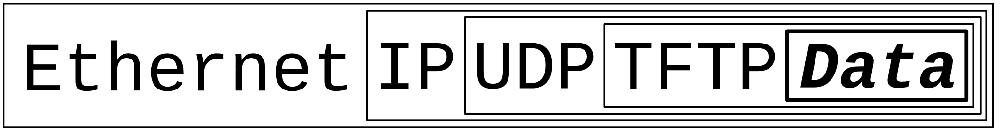

Certainly! I'll reformat the markdown to ensure that inline code and code blocks are displayed properly. Here's the corrected version:

# Approach
Since we have no Idea about HTTP server we first need to read and understand basic underlying concepts.
This includes reading relevant Information about the follwoing topics:
1. Networking: Familiarize yourself with socket programming and the basics of TCP/IP communication. This will involve understanding concepts like IP addresses, ports, and socket operations.
2. HTTP Protocol: Learn about the HTTP protocol and its request/response structure. Understand the different HTTP methods (GET, POST, etc.), status codes, and headers.
3. Multithreading: Since an HTTP server needs to handle multiple client connections simultaneously, you'll need to learn about multithreading or asynchronous programming to handle concurrent requests efficiently.
4. File I/O: HTTP servers often serve static files, so understanding file I/O operations in C++ will be essential.

# First Ressources to get started
1. Networking in C/C++:
	- Beej's Guide to Network Programming: http://beej.us/guide/bgnet/
	- "TCP/IP Sockets in C: Practical Guide for Programmers" by Michael J. Donahoo and Kenneth L. Calvert
2. HTTP Protocol:
	- "HTTP: The Definitive Guide" by David Gourley and Brian Totty
	- Mozilla Developer Network (MDN) HTTP Guide: https://developer.mozilla.org/en-US/docs/Web/HTTP/Guide
3. Multithreading in C++:
	- "C++ Concurrency in Action" by Anthony Williams
	- "Effective Modern C++" by Scott Meyers (Chapter 6: "Lambda Expressions")
4. File I/O in C++:
	- "C++ Primer" by Stanley B. Lippman, Josée Lajoie, and Barbara E. Moo (Chapter 10: "Input and Output")


# Summary of the Ressources
## Networking from Beej's Guide to Network Programming:
### Chapter 1: What is a Socket?
1. What are sockets?
   A way to speak to other programs using standard Unix file descriptors. Everything on Unix is a file and I/O is always done by reading/writing from/to a file descriptor.
2. Where do I get the this file descriptor?
   A call to `socket()`. Then you can communicate via `send()` and `recv()` (use man).
   `read()` and `write()` would also work, but prior functions offer much more control over the data transmission.
   There are lots of different types of sockets, but for the HTTP server we just need Internet sockets for now.
3. Are there several types of Internet sockets?
   Yes, there are many however we for now focus on two types of sockets. One is the "Stream Socket" also refered to as "SOCK_STREAM" and the other is the "Datagram Socket" also refered to as "SOCK_DGRAM" and sometimes called "connectionless socket".
4. What is a "SOCK_STREAM"?
   Stream sockets are reliable two-way connected communication stream. They work like pipes with the FIFO method.
5. What uses Stream Sockets?
   `telnet` (`man telnet`) and `ssh` applications for example use stream sockets. The web browser with HTTP also uses Stream Sockets to get pages.
   To get an first idea on how it works, you can try to telnet to a website over port 80. Type the following example into the command line: `telnet google.com 80`. It will open telnet with a prompt `telnet>` then type "GET / HTTP/1.0" and hit RETURN twice. Then you will recieve the response from the server.
   ```
   user@hostname: ~/cwd$ telnet google.com 80'
   telnet> GET / HTTP/1.0

   (HTTP Response)
   ```
6. How do stream sockets achieve this high level of data transmission quality?
   They use a protocol called TCP (Transmission Control Protocoll) (`man TCP`) which makes sure that the data arrives sequentually and error-free. It is usually seen paired with IP (Internet Protocoll) as TCP/IP, where IP deals primarily with the routing and TCP ensures the data integrity.
7. What is a "SOCK_DGRAM"? Why are they also called connectionless sockets?
   Connectionless sockets are called so because they do not establish a persistent connection between the sender and receiver. Instead, they send discrete packets of data called datagrams. Each datagram is independent and self-contained, containing all the necessary information for the receiver to process it. This means the packet might arrive or not arrive. If it arrives, the data within the datagram will be error-free.
   Those sockets use IP, but instead of TCP they use UDP (User Datagram Protocol).
8. What Datagram Sockets used for?
   Datagram sockets are often used in scenarios where a reliable, ordered delivery of data is not required, and where the focus is on lightweight, low-latency communication. Examples of applications that use datagram sockets include DNS (Domain Name System) and DHCP (Dynamic Host Configuration Protocol). Another examples include online gaming, audio and video streaming and video conferencing. For example YouTube always preloads videos so the video can keep running even if the internet connection drops for a moment. If packets are dropped in online games, it usually leads to well known "lags".
   Some applications like `tftp` (trivial file transfer protocol, a little brother to FTP) or `dhcpcd` transfer binary applications from one host to another, so nothing can be lost. Well in this case for example `tftp` waits for the recepient to sent a packet back that aknowledges a successfull reception. If it is not recieved in a certain amount of time, the package will be retransmitted. This procedure is extremly important to ensure reliable `SOCK_DGRAM` applications.
9. Network Theory and encapsulation
   `SOCK_DGRAM` packets are built through encapsulation, which means each protocoll adds another another layer of encapsulation:
   
   A packet is born, the packet is wrapped ("encapsulated") in a header (and rarely a footer) by the first
   protocol (say, the TFTP protocol), then the whole thing (TFTP header included) is encapsulated again by
   the next protocol (say, UDP), then again by the next (IP), then again by the final protocol on the hardware
   (physical) layer (say, Ethernet).
   When another computer receives the packet, the hardware strips the Ethernet header, the kernel strips the
   IP and UDP headers, the TFTP program strips the TFTP header, and it finally has the data.
   The *Layered Network Model* aka "ISO/OSI":
   - Application
   - Presentation
   - Session
   - Transport
   - Network
   - Data Link
   - Physical
   The next model has less Layers, however the following model is more consistent with Unix and the idea of encapsulation:
   - Application Layer (telnet, ftp, etc.)
   - Host-to-Host Transport Layer (TCP, UDP)
   - Internet Layer (IP and routing)
   - Network Access Layer (Ethernet, wi-fi, or whatever)
   Stream Sockets just need to `send()` the data out, while datagram sockets need to encapsulate the data with another method and then `sendto()` another host.
   The kernel builds the Transport and Internet Layer while the hardware does the Network Access Layer.

### Chapter 2: IP Addresses, Structs and Data Munging
1. IP Addresses, versions 4 and 6
   We ran out of IPv4 Adresses because they were generously allocated to companies and there are just so many computers, espacially small computers such as phones, IoT and so on around the world.
   So IPv6 was born.
   Here is a small table comparing IPv4 and IPv6:
   | IPv4 | IPv6 |
   |------|------|
   | Uses 32-bit addresses | Uses 128-bit addresses |
   | Provides approximately 4.3 billion unique addresses | Provides approximately 340 undecillion unique addresses |
   | Address format: xxx.xxx.xxx.xxx | Address format: xxxx:xxxx:xxxx:xxxx:xxxx:xxxx:xxxx:xxxx |
   | Uses decimal notation | Uses hexadecimal notation |
   | Less efficient in terms of address space | More efficient in terms of address space |
   | Limited support for built-in security features | Built-in support for IPsec and other security features |
   | Network address translation (NAT) is commonly used to conserve IPv4 addresses | No need for NAT due to the abundance of IPv6 addresses |
   | Widely used and supported | Adoption is still ongoing |
   | Loopback adress: 127.0.0.1 | Loopback adress: ::1 |
   | 192.0.2.33 | ::ffff:192.0.2.33 |
2. Subnets
   Subnetting should be clear through the previous 42 project on subnetting. As in IPv4 IPv6 also allowes the use of subnet masks aka a slash followed the number of network bits:
   `192.0.2.12/30` and int IPv6 `2001:db8::/32` or `2001:db8:5413:4028::9db9/64`
3. Port numbers
   It's a 16-bit number that's like the local address for the connection.
   Think of the IP address as the street address of a hotel, and the port number as the room number.
   Different services on the Internet have different well-known port numbers. ([the big IANA Port List](https://www.iana.org/assignments/service-names-port-numbers/service-names-port-numbers.xhtml))(on Unix: `/etc/services`)
4. Byte Order
   - Big-Endian: The most significant byte is stored at the lowest memory address.
   - Little-Endian: The least significant byte is stored at the lowest memory address.
   - Network Byte Order: Big-Endian is used for transmitting data over the network.
   - Host Byte Order: The byte order used by the host machine.
   
   Example:
   Let's say we have a 16-bit integer with the value 0x1234 (hexadecimal). In Big-Endian, it would be stored as 0x12 0x34, with the most significant byte (0x12) at the lower memory address. In Little-Endian, it would be stored as 0x34 0x12, with the least significant byte (0x34) at the lower memory address.

   Network Byte Order is important for network communication because different machines may have different byte orders. To ensure interoperability, network protocols specify that data should be transmitted in Big-Endian order. Host Byte Order refers to the byte order used by the machine running the program. When sending or receiving data over the network, the program needs to convert between Network Byte Order and Host Byte Order to ensure correct interpretation of the data.
   The following functions help to convert between Host and Network Byte Order:
   | Function     | Description              |
   |--------------|--------------------------|
   | `htons()`    | **h**ost **to** **n**etwork **s**hort    |
   | `htonl()`    | **h**ost **to** **n**etwork **l**ong     |
   | `ntohs()`    | **n**etwork **to** **h**ost **s**hort    |
   | `ntohl()`    | **n**etwork **to** **h**ost **l**ong     |
5. Data `struct`s
   A socket descriptor is of type `int`.
   The `addrinfo` structure is used in socket programming to store information about a network address. It is defined in the `<netdb.h>` header file.
   ```c
   struct addrinfo
   {
   int             ai_flags;       // AI_PASSIVE, AI_CANONNAME, etc.
   int             ai_family;      // AF_INET, AF_INET6, AF_UNSPEC
   int             ai_socktype;    // SOCK_STREAM, SOCK_DGRAM
   int             ai_protocol;    // use 0 for "any"
   size_t          ai_addrlen;     // size of ai_addr in bytes
   struct sockaddr *ai_addr;       // struct sockaddr_in or _in6
   char            *ai_canonname;  // full canonical hostname
   struct addrinfo *ai_next;       // linked list, next node
   };
   ```
   - `ai_flags`:
     This member is used to specify additional options for the address resolution. Some common flags include AI_PASSIVE (for server sockets), AI_CANONNAME (to obtain the canonical name of the host), and AI_NUMERICHOST (to indicate that the host parameter is a numeric IP address).
   - `ai_family`:
     This member specifies the address family, which can be AF_INET (IPv4), AF_INET6 (IPv6), or AF_UNSPEC (unspecified, allowing both IPv4 and IPv6).
   - `ai_socktype`:
     This member specifies the socket type, which can be SOCK_STREAM (for TCP sockets) or SOCK_DGRAM (for UDP sockets).
   - `ai_protocol`:
     This member specifies the protocol to be used. If set to 0, the system will choose the appropriate protocol based on the ai_family and ai_socktype.
   - `ai_addrlen`:
     This member stores the size of the ai_addr structure in bytes.
   - `ai_addr`:
     This member is a pointer to a sockaddr structure that represents the network address. The actual type of the structure depends on the address family (ai_family).
   - `ai_canonname`:
     This member is a pointer to a null-terminated string that contains the canonical name of the host.
   - `ai_next`:
     This member is a pointer to the next addrinfo structure in a linked list. It is used when multiple addresses are returned by the address resolution process.
   The addrinfo structure is commonly used with functions like `getaddrinfo()` (`man getaddrinfo()`) to perform address resolution and obtain a list of suitable addresses for network communication.

   For the `struct sockaddr` there can be different or combined versions for IPv4 and IPv6.
   ```c
   struct sockaddr
   {
       unsigned short  sa_family;      // address family, AF_xxx
       char            sa_data[14];    // 14 bytes of protocol address
   };
   ```
   - `sa_family`:
     Can be a variety of things, but for us it's important to know that it will be mostly either `AF_INET`(IPv4) or `AF_INET6`(IPv6).
   - `sa_data`:
     Contains the a destination adress  and port numbers for the socket.
   
   There are parallel structures such as `struct sockaddr_in` for (IPv4 and 'in' such as "Internet"), basically overloaded structures to deal with the correct IP (v4 or v6).
   The important part is: 
   **A pointer to a `struct sockaddr_in` can be cast to a pointer to a `struct sockaddr` and vice-versa. So even though `connect()` wants a `struct sockaddr*`, you can still use a `struct sockaddr_in` and cast it at the last minute!**
   ```c
   // (IPv4 only--see struct sockaddr_in6 for IPv6)
   struct sockaddr_in
   {
   short int           sin_family;     // Address family, AF_INET
   unsigned short int  sin_port;       // Port number
   struct in_addr      sin_addr;       // Internet address
   unsigned char       sin_zero[8];    // Same size as struct sockaddr
   };
   ```
   This structure makes it easy to reference elements of the socket address.
   - `sin_family`:
     Address family and corresponds to `sa_family`, it should be set to AF_INET.
   - `sin_port`:
     Port number bust my in Network Byte Order, using `htons()`.
   - `sin_zero`:
     Padding to match the length of a struct sockaddr, should be set to all zeros using memset().
   - `sin_addr`:
     Is a `struct in_addr`
     ```c
     // (IPv4 only--see struct in6_addr for IPv6)
     // Internet address (a structure for historical reasons)
     struct in_addr
     {
     uint32_t    s_addr; // that's a 32-bit int (4 bytes)
     };
     ```

   To bind it all together lets say we declared the `struct sockaddr_in` to be `ina` then we can simply extract the IP adress with `ina.sin_addr.s_addr`


				


			
	


